> ssh_shop(表白吧)项目是之前自己用ssh框架写的一个网上商城项目，由于之前做作业的时候，课堂上做了一个前端页面，所以索性整合了后端，所以才有现在的表白吧。这个也是自己写的比较大的一个项目了，功能上包含了 许多内容，下面都会有讲解到，之前也用过jsp做过商城项目[sping_jsp](https://github.com/heclam/shopping_jsp)
##### 搭建环境介绍一下:
  > * ssh_shop之前是在myeclipse下创建的，现在把他导入到了idea
  > * mysql5.7
  > * tomcat9.0
  > * Struts2、Spring、Hibernate框架
##### 前端页面（功能介绍）
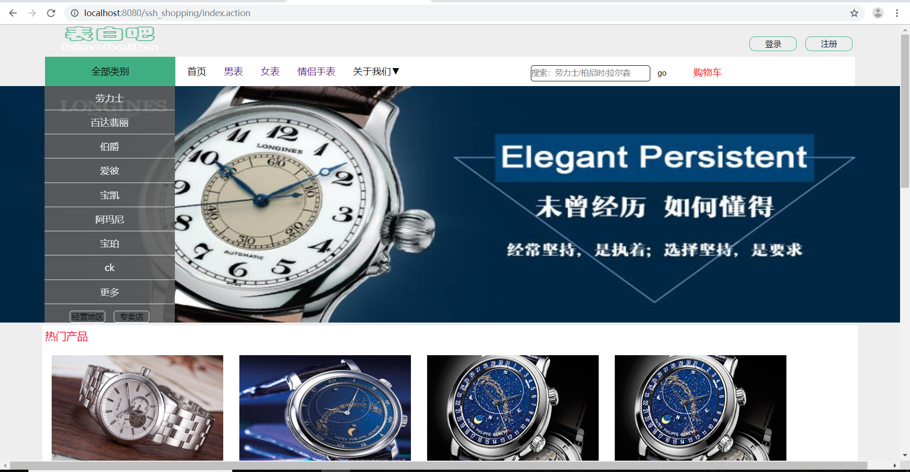
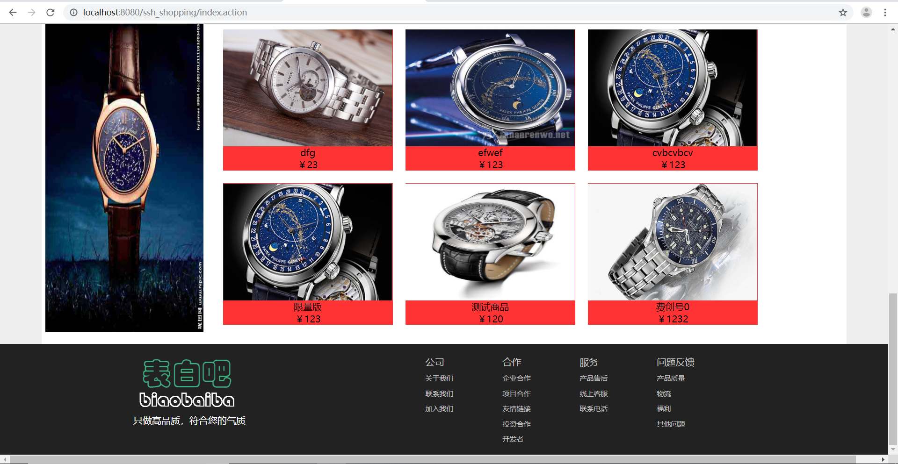
登陆、注册界面都前端的(js)校验，注册界面检查用户名是否可用，这里使用了ajax异步查询，还使用了验证码的形式进行校验注册，这里采用了邮箱的注册方式进行注册，发送邮箱后需要登陆邮箱点击激活用户。
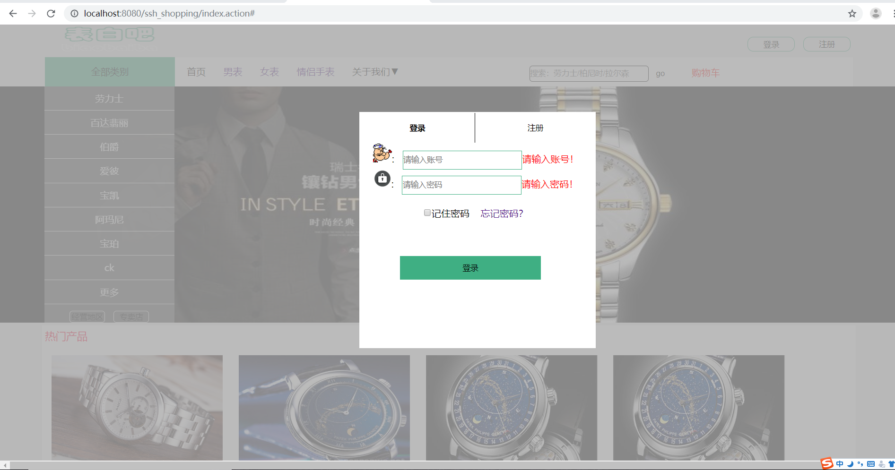
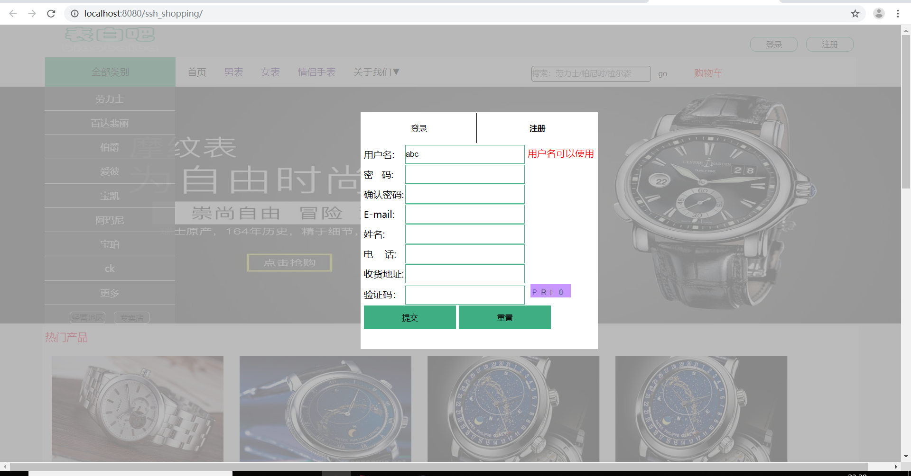
下面是购物流程(这里也是采用了多级分类的方式)
可以根据分类来挑选商品
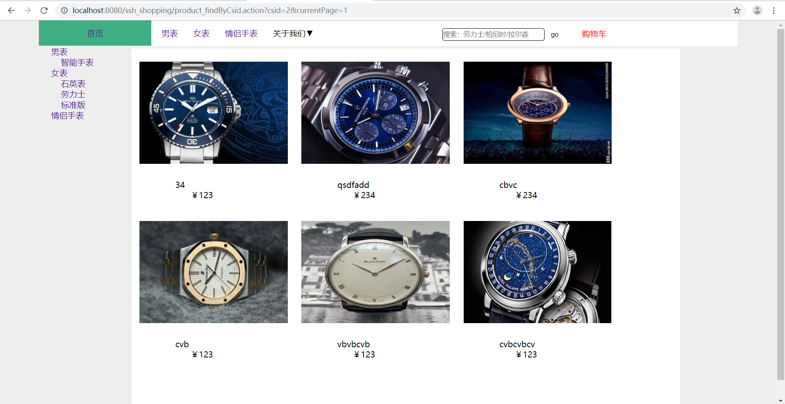
商品详情
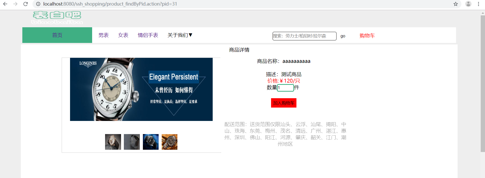
购物车
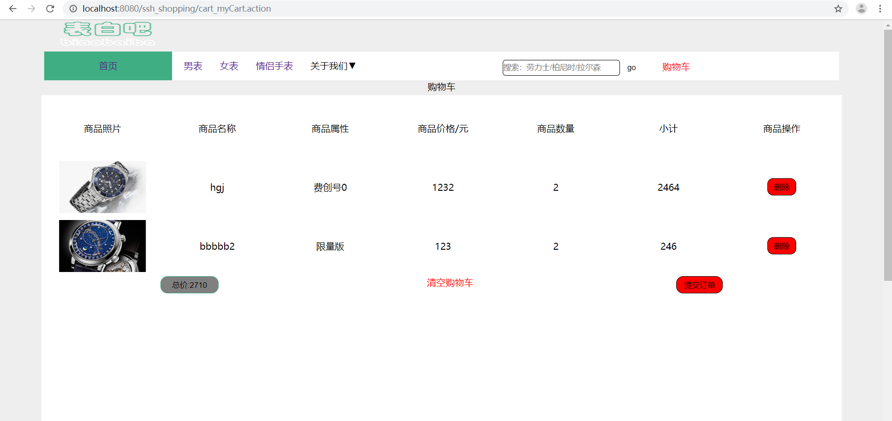
当然了，必须是登陆成功之后才可以买单的
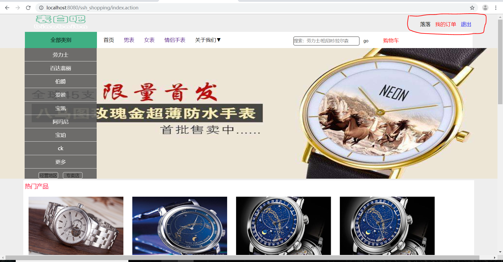
订单页面
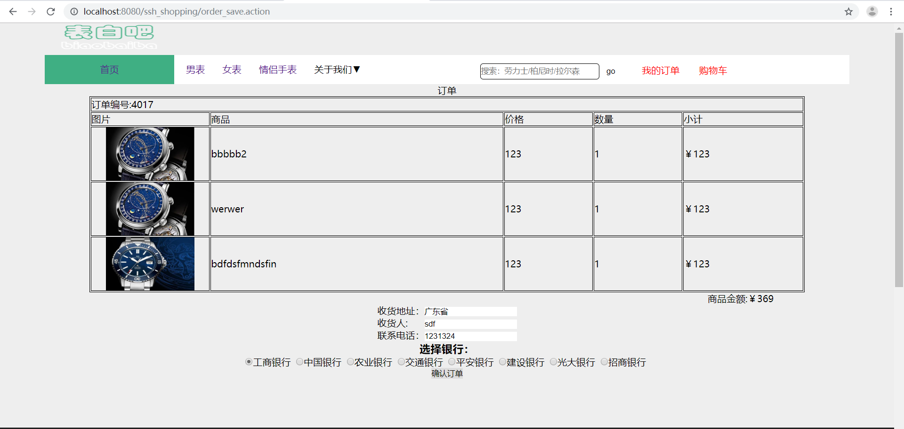
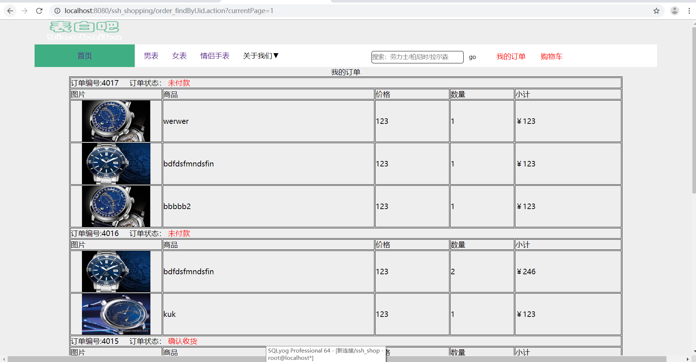
提交订单，交钱，这里使用的是易宝第三方品台,之前还可以，目前好像是不支持了
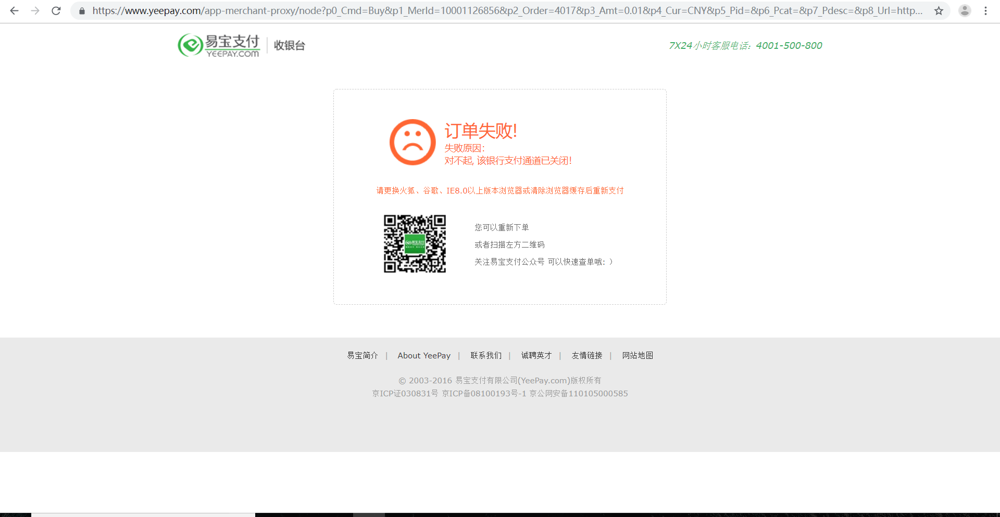
##### 后端页面（效果图如下）
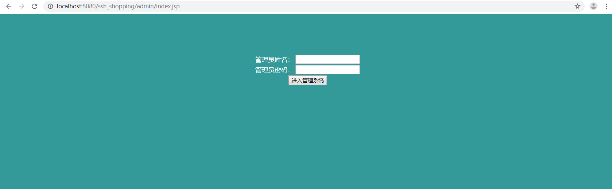
后台分为3各模块：
用户模块、分类模块(可以添加一级或二级分类)
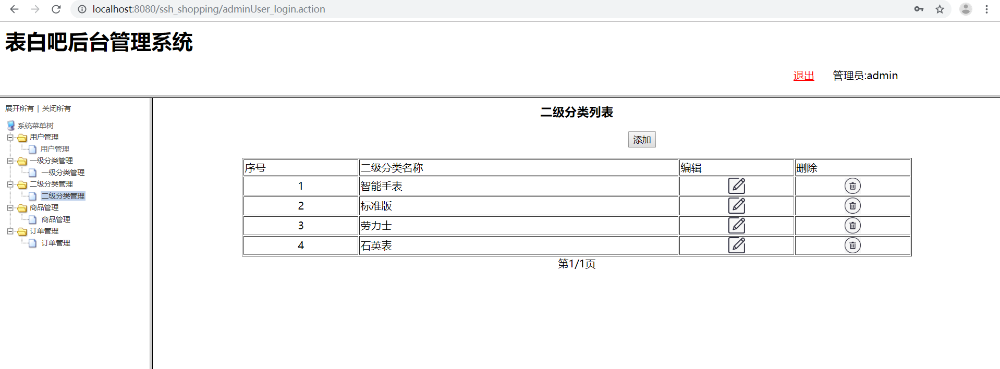
商品模块（可以crud商品）
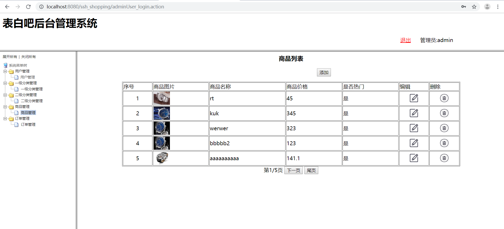
订单模块（可以查看订单状态、确认发货等）
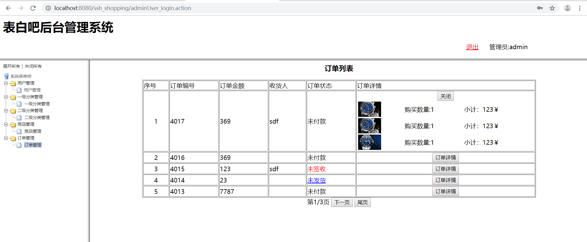

